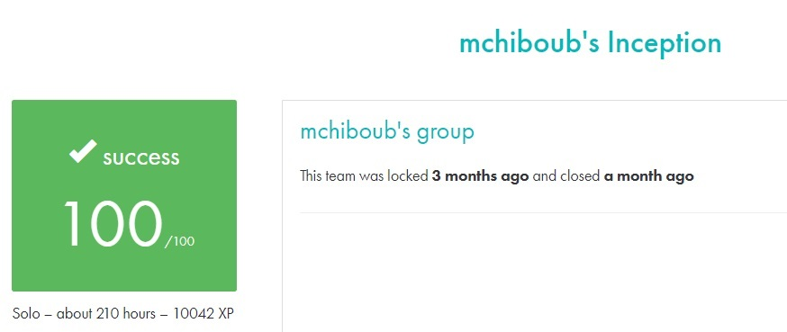

# INCEPTION #

## What the project does: ##
The Inception project focuses on system administration using Docker. It involves setting up a small infrastructure with multiple services such as NGINX, WordPress, and MariaDB. Each service runs in its own Docker container, and the entire infrastructure is managed with Docker Compose. The project requires you to create and configure Docker images from scratch, without using pre-built images.

## Why the project is useful: ##
This project is useful because it teaches essential system administration skills, including containerization with Docker, managing services, and securing infrastructure. It helps you build a deeper understanding of Docker, which is widely used for deploying scalable and isolated applications in the industry.

[Subject of this project](en.subject.pdf)